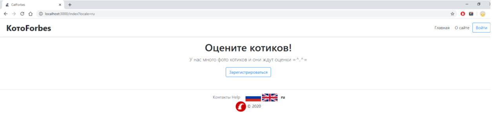
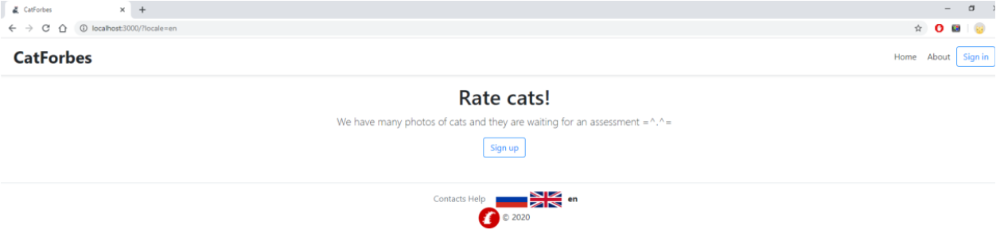
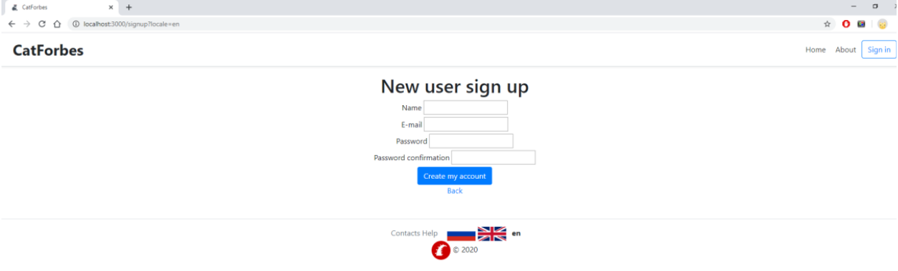
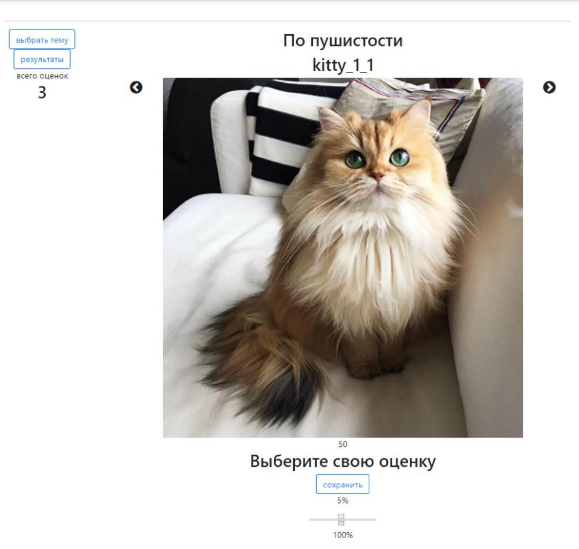
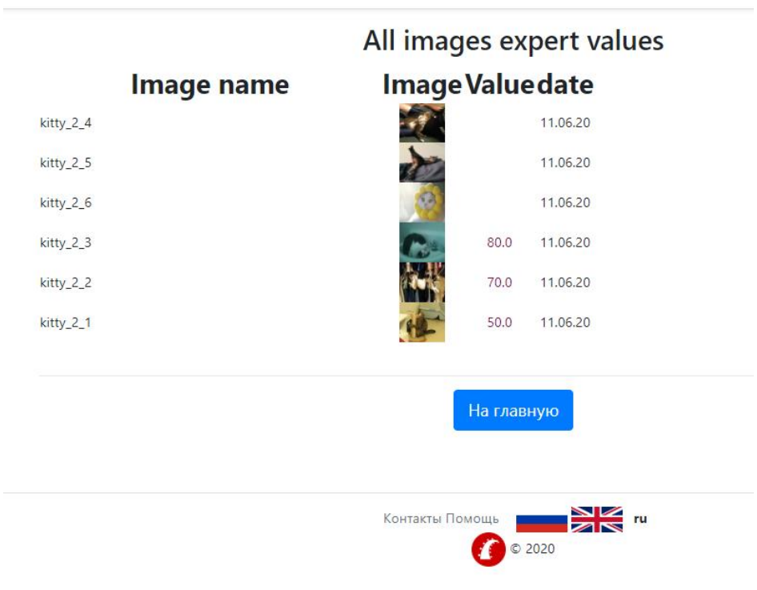

# CatForbes
Приложение CatForbes реализует архитектурный шаблон MVC и содержит:

* Header, Footer, Main, Help, About. 

* Регистрация и Login/Logout пользователя.

* На Рабочей странице (Main):

*    форма выбора изображения типа select

*    отображение выбранного изображения

*    ввод значения пользователем (шкала)

*    отображение обобщенного результата

*    перелистывание изображений на экране

* На странице "Результаты" отображаются в табличной форме название изображения, оценка и дата.

* На странице "Моя страница" отображается информация о пользователе: Имя пользователя, его аватар, адрес электронной почты.

Использовались следующие инструменты:

*  ОС Windows 10

* Фреймворк Ruby on Rails

* Система управления версиями Git

* Среда разработки RubyMine

* СУБД PostgreSQL

* Браузер Google Chrome

* Терминал Windows

* Стили - Sass, разметка - Haml.

